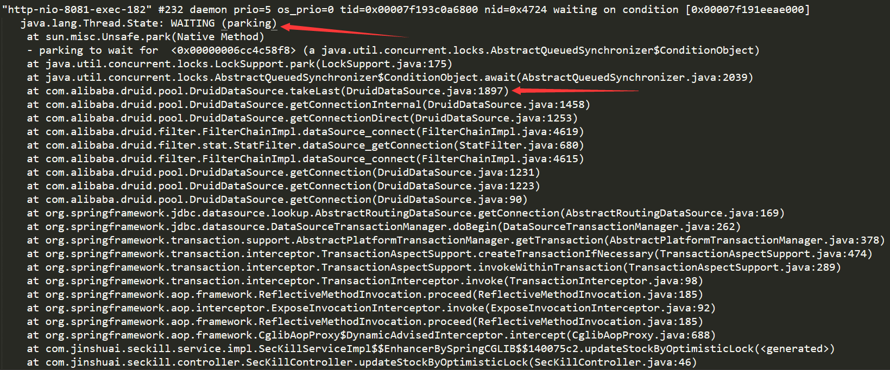
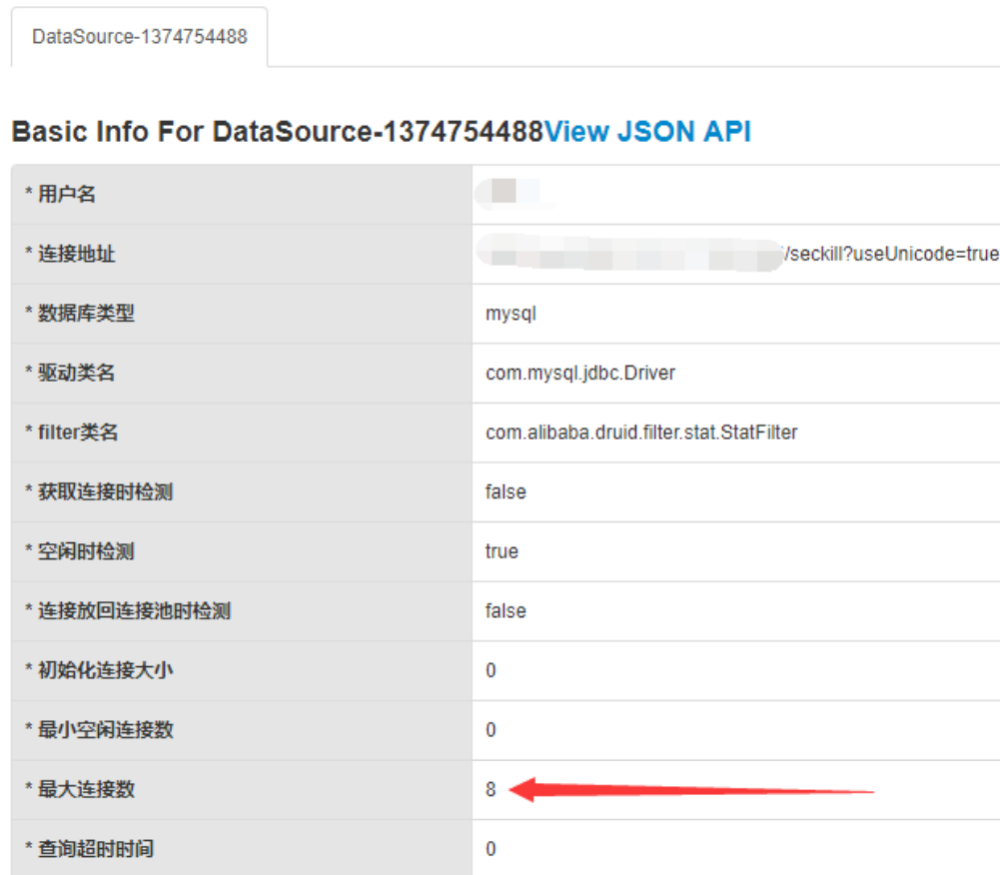

# 2018-08测试情况(1w并发量测试)
  > 测试脚本环境
  >> E3-1230 v5 @ 3.40GHz X4  8G RAM  
  
  > 项目运行环境
  >> i5-4200m X1 8G RAM (屌丝笔记本...)
  
主要目的是性能测试，对比不同方案的性能：
- 在不添加缓存的情况下，乐观锁悲观锁效果在响应时间上相差不是特别大，乐观锁响应时间相对较低，不过并发量大的情况乐观锁更新成功的概率比较低，可能造成CPU额外的空转。
- 当添加了缓存，将商品信息缓存起来，响应时间大幅下降。
  
  
|并发控制|Avg|Min|Max|
|:-----:|:-:|:-:|:-:|
|悲观锁(未使用缓存)X1|5733|11|16961
|悲观锁(未使用缓存)X2|6044|10|17806
|悲观锁(未使用缓存)X3|6593|10|19206
|乐观锁(未使用缓存)X1|3176|5|11399
|乐观锁(未使用缓存)X2|2594|6|9521
|乐观锁(未使用缓存)X3|5312|7|13707
|乐观锁(使用Redis缓存)X1|96|6|1322
|乐观锁(使用Redis缓存)X2|111|5|2336
|乐观锁(使用Redis缓存)X3|736|7|3545

## 悲观锁结果

## 乐观锁结果  

## 乐观锁&&缓存结果  

  
# 2019-06测试情况(20W并发量测试)
> 测试脚本环境
>>Intel(R) Core(TM) i7-6800K CPU @ 3.40GHz X4  16G RAM  (10W并发量)  
>>Intel(R) Xeon(R) CPU E3-1230 v5 @ 3.40GHz X3 60G RAM  (10W并发量)
    
> 项目运行环境
>>Intel(R) Xeon(R) CPU E3-1230 v5 @ 3.40GHz X4 8G RAM

主要目的是压力测试，当并发量高的话会出现那些问题
## 1. 【初始阶段】大量CLOSE_WAIT连接
问题描述：  
在测试前期，就是测试脚本执行初始阶段发现服务端TCP大量的连接处于CLOSE_WAIT状态，峰值将近10000，并且大量线程都处于等待获取数据库连接池这一步，
当到了测试中后期状态CLOSE_WAIT连接数量会处于平稳状态，CLOSE_WAIT数量最高不过500，但是线程栈还是处于等待获取数据库连接。

服务端、客户端状态：
1. 查看服务端
- 查看TCP连接: `netstat -nat | awk 'FNR>2{print $NF}' | sort | uniq -c`处于CLOSE_WAIT状态的连接接近10000。  
  

- 查看线程栈: `jstack pid > seckill.log` 大量线程处于 **等待获取数据库连接池连接**(连接池用的Druid)

- 查看数据库连接池配置：Druid开了HTTP服务,可视化展示配置参数`ip:port/druid` 默认最大可用数量为8...

2. 查看客户端  
客户端使用的是Jmeter，除了基本的配置外，额外添加了请求超时时间，为5秒。聚合报告出现了大量的请求超时响应。  

结论：  
当客户端请求打过来后，由于处理这个请求的线程获取不到可用的数据库连接，导致阻塞等待，当客户端超时以后，发送FIN报文断开连接，而线程处于阻塞等待状态，来不及释放FIN报文，导致出现大量处于CLOSE_WAIT状态的连接。
但是到后期的时候，CLOSE_WAIT不是太高，是因为用到了Redis限制用户重复购买以及限制用户请求频率。因为前期所有用户都没有购买商品，所以会有相对较多的请求打到DB，而后期大量的用户已经购买的商品，请求大多都是Redis处理。

解决方案：  
因为并没有出现代码逻辑错误导致没有关闭连接，而是服务端等待获取可用数据库连接导致客户端超时出现了大量CLOSE_WAIT。  
缓解这个问题的思路是调高了数据库连接池最大可用连接数量(`spring.datasource.druid.slave.max-active`)。 额外的思路是加机器？？？TODO

## 2.MySQL异常 服务端抛异常、远程登录不上MySQL
> `ERROR 1040 (HY000): Too many connections`，获取不到可用的连接：服务端抛异常、远程登录不上MySQL。原因是MySQL最大连接数量有限制，查看默认最大连接数量：`show variables like '%max_connections%'`只有3.... 。

临时解决方案：重启MySQL，修改MySQL最大连接数量,修改到了1000。

## 3.在DB层面使用乐观锁保证线程安全以后，仍然会出现超卖问题
> 由于用到了消息队列，刚开始以为是消息队列消费端的问题，不过在消费端已经做了幂等性处理。  
输出的异常日志中出现了NullPointerException，是在消息入队后抛出的，此时就会事务就会回滚，但是消息不是事务的，消息已经放到消息队列中所以会出现超卖问题  
抛出异常是因为，我随机生成的测试数据中有的userId数据库中没有，又因为当将消息添加到消息队列以后，还需要将用户针对这件商品的购买记录添加到缓存中，在执行user.getUserId()时抛出了NPE

解决方案：属于代码编写问题。在执行入队之前，先判断User是否为空，如果为空直接抛异常，消息不入队。否则正常入队。

---
## 4.TODO: " ROCKETMQ [TIMEOUT_CLEAN_QUEUE]broker busy "