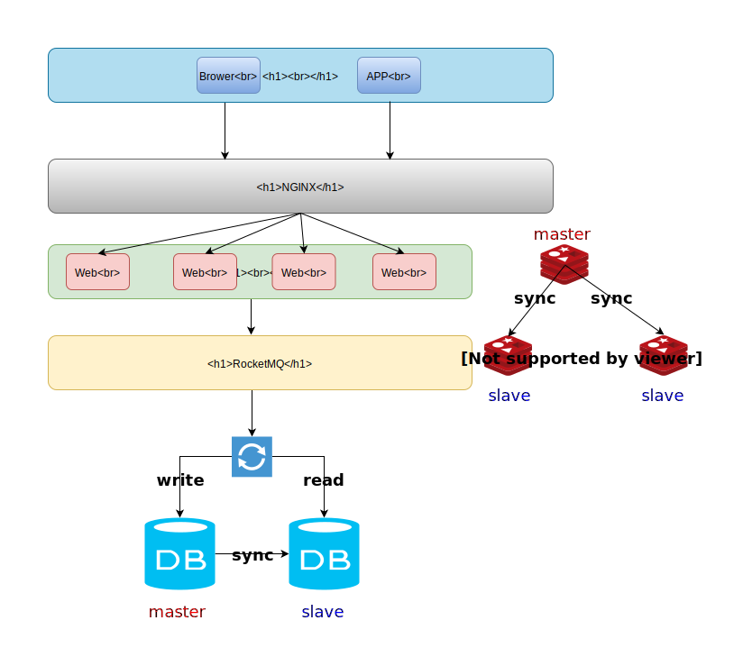

# SecKillSystem
SecKillSystem是一个基于SpringBoot的商品秒杀模块。


## 服务端设计思路
- 瓶颈数据库处理请求能力。大量请求打到数据库以后，由于数据库处理请求能力有限，可能会造成超时或者宕机等。所以思路就是尽量将请求拦截在系统上游(可以在前台通过`js`做一些限制、用`CDN`和用户浏览器缓存一些静态资源等...)
- 读多(**读库存**)写少(**创建订单**)的应用，多使用缓存(对于查询库存操作通过缓存实现，减少数据库操作)
- 缓存、应用、数据库做集群，做负载均衡;消息异步处理

### 整体架构



### 秒杀流程
#### 1 判断用户是否重复购买  
将用户id和产品id组合起来放到Redis集合中，当用户请求打过来时，判断Redis集合中是否存在userId + ":" + productId，**注意:一定要加分隔符，因为如果不加分隔符，1 + 23 和 12 + 3效果一样。**
```Java
    private void checkRepeat(User user, Product product, Jedis jedis) {
        // 将用户Id和商品Id作为集合中唯一元素
        String itemKey = user.getId() + ":" + product.getId();
        if (jedis.sismember("item",itemKey)) {
            throw new SecKillException(StatusEnum.REPEAT);
        }
    }
```

#### 2 判断用户请求次数是否已达上限  
将用户标识作为Redis中的一个可以过期的String，每次用户请求会判断，该用户请求的次数是否已经达到上限
```Java
    /**
     * 限速：用户5秒内请求次数不能超过10次
     * TODO: 硬编码
     *
     * */
    private void limitRequestTimes(User user, Product product, Jedis jedis) {
        // 每个用户的请求标识
        String itemKey = "user:limit:"+user.getId();
        // 已经请求的次数
        String reqTimes = jedis.get(itemKey);
        // 第一次请求：设置初始值
        if (reqTimes == null) {
            jedis.set(itemKey,"1");
            jedis.expire(itemKey,5);
        }
        // 限速
        else if (Integer.valueOf(reqTimes) >= 10) {
            log.warn("用户[{}]频繁请求商品[{}]",user.getId(),product.getId());
            throw new SecKillException(StatusEnum.FREQUENCY_REQUEST);
        }
        // 还没超过限制次数
        else {
            jedis.incr(itemKey);
        }
    }
```
#### 3 查库存
查库存可能会出现缓存穿透，如果查询到缓存中不存在的值，就会去数据库中查找。如果频繁遇到这种情况，一直访问数据库，那缓存也就没多大效果了。解决办法是如果缓存中不存在请求的key，那缓存就缓存下这个key，然后向上抛异常。
```Java
    /**
     * 1. 处理缓存穿透 2. 检查库存
     * */
    private void checkStock(Product product, Jedis jedis) {
        int productId = product.getId();
        String cacheProductKey = "product:" + productId + ":stock";
        String stockStr = jedis.get(cacheProductKey);
        // 缓存未命中
        if (stockStr == null) {
            log.warn("商品编号: [{}] 未在缓存命中",productId);
            // 在存储层去查找
            product = secKillDao.getProductById(productId);
            // 存储层不存在此商品
            if (product == null) {
                log.warn("商品编号: [{}] 未在存储层命中,已添加冗余数据到缓存",productId);
                // 通过缓存没意义的数据防止缓存穿透
                jedis.set(cacheProductKey,"penetration");
                throw new SecKillException(StatusEnum.INCOMPLETE_ARGUMENTS);
            }
            // 存储层存在此商品，添加到缓存：先判断再修改会导致并发修改不安全，通过加锁避免
            else {
                synchronized (this) {
                    // 如果没有在缓存中设置此商品，再设置
                    if (jedis.get(cacheProductKey) == null) {
                        jedis.set(cacheProductKey,String.valueOf(product.getStock()));
                    }
                    // 检查此商品在缓存里的库存
                    checkCacheStock(productId, jedis);
                }
            }
        }
        // 缓存命中
        else {
            // 命中无意义数据
            if ("penetration".equals(stockStr)) {
                throw new SecKillException(StatusEnum.INCOMPLETE_ARGUMENTS);
            } else {
                // 检查此商品在缓存里的库存
                checkCacheStock(productId, jedis);
            }
        }
    }
```

#### 4 更新库存
查询Redis中缓存的商品库存，因为这里涉及到先查询库存，操作一：**如果**库存大于0 操作二：更新库存。不是原子操作，在多线程并发情况下，比如库存中某个商品库存是1，此时两个线程都查出的是1，接着都去更新库存，导致库存为-1出现超卖。由于采用的是乐观锁，在数据库层面没有加锁，所以无法通过加锁解决。不过可以利用Redis单线程特性，当查询到库存大于0时，继续进行减库存，然后**返回**减完以后的库存值，如果库存小于0就说明操作失败。
```Java
    /**
     * 更新缓存库存和数据库库存
     *
     * */
    private void updateStock(Product product, Jedis jedis) {
        int productId = product.getId();
        String cacheProductStockKey = "product:" + productId + ":stock";
        // 更新缓存库存
        long currentCacheStock = jedis.decr(cacheProductStockKey);
        // 防止并发修改导致超卖
        if (currentCacheStock < 0) {
            jedis.set(cacheProductStockKey,String.valueOf(0));
            throw new SecKillException(StatusEnum.LOW_STOCKS);
        } else {
            // 更新数据库商品库存
            int count = secKillDao.updateStockByOptimisticLock(product);
            if (count != 1) {
                // 更新数据库商品库存失败，回滚之前修改的缓存库存
                jedis.incr(cacheProductStockKey);
                throw new SecKillException(StatusEnum.LOW_STOCKS);
            }
        }
    }
```
#### 5 订单入队列
对每一个订单加上唯一标识`UUID`，消费者消费时根据订单的唯一标识`UUID`查询是否已经消费了这个订单。[RocketMQ不建议用MessageID，因为MessageID可能会冲突(重复)。](https://help.aliyun.com/document_detail/44397.html?spm=a2c4g.11174283.6.651.3102449czbJGKh)
```Java
    /**
     * 订单入队列，等待消费
     * 
     * */
    private void createOrder(Product product, User user, Jedis jedis) {
        DateTime dateTime = new DateTime();
        Timestamp ts = new Timestamp(dateTime.getMillis());
        Order order = new Order(user,product,ts, UUID.randomUUID().toString());
        // 放到消息队列 TODO 可以提示用户正在排队中... ...
        orderProducer.product(order);
        // 在Redis中缓存购买记录，防止重复购买
        String itemKey = user.getId() + ":" + product.getId();
        jedis.sadd("item",itemKey);
    }
```
#### 6 消费者消费订单，最终保存到数据库
消费时先根据这条订单的UUID在Redis中查找，判断是否已经消费过这条订单，如果没有的话，将这个订单的UUID添加到Redis集合中。将订单持久到数据库中
```Java
    public void consume(Order order) {
        try (Jedis jedis = jedisPool.getResource()) {
            // 已经消费过此条消息
            if (jedis.sismember("orderUUID",order.getOrderUUID())) {
                log.warn("消息[{}]已经被消费",order);
                return;
            }
            // 添加这条订单的UUID到Redis中
            jedis.sadd("orderUUID", order.getOrderUUID());
            secKillDao.createOrder(order);
            log.info("订单出队成功，当前创建订单总量[{}]", orderNums.addAndGet(1));
        } catch (Exception e) {
            log.error("订单[{}]出队异常",order,e);
        }
    }
```
# 部分技术实现
## MySQL主从复制、读写分离
- MySQL主从复制在数据库层面实现即可
- 读写分离
  - 读写分离的最终效果是：在访问数据库时，在业务端决定它应该用哪个数据源。对于只读操作就访问从数据库，对于写操作就访问主库。
  - Spring中内置了一个`AbsractRoutingDataSource`类，它内部维护了一个Map`private Map<Object, Object> targetDataSources;`用来存放多个数据源，可以根据不同的key从Map中获取不同的数据源。所以只要重写它通过key来查找目标数据源的方法，用我们预期的key来获取目标数据源即可。
  - 需要继承`AbsractRoutingDataSource`将创建的目标数据源放到它维护的Map中，然后重写它通过key来查找目标数据源的方法`protected abstract Object determineCurrentLookupKey();`。将它要用的key在执行方法前通过AOP提前放到ThreadLocal中，执行`determineCurrentLookupKey()`时通过ThreadLocal存放的值作为key查找Map里的数据源。
    - 将预期的key放到注解中，注解修饰特定的方法，通过Sping AOP在执行方法前获取注解里的key，放到`ThreadLocal`中，

# 进度
## Finished
- [x] 通过Redis实现缓存，每次查询库存都从Redis进行查找(注意缓存雪崩和缓存穿透)
- [x] 通过Redis复制以及哨兵机制实现了缓存高可用
- [x] 使用RocketMQ作为消息队列进行流量削峰
- [x] SpringBoot(SSM)作为整个项目的框架，**个人感觉**相比SpringDataJPA，MyBatis更灵活一些
- [x] MySQL持久化数据，分别采用乐观锁、悲观锁进行并发控制并通过JMeter进行性能测试。
- [x] 结合MySQL主从复制特性，在应用层通过AOP实现了读写分离

## TODO
- [ ] 分布式集群(比如MySQL、Redis、~~SpringBoot、Nginx进行负载均衡~~)
- [ ] 解决MySQL主从复制带来的数据不一致性问题
- [ ] 每次只放指定数量的请求到消息队列，等处理完毕再重新拉请求入队列。